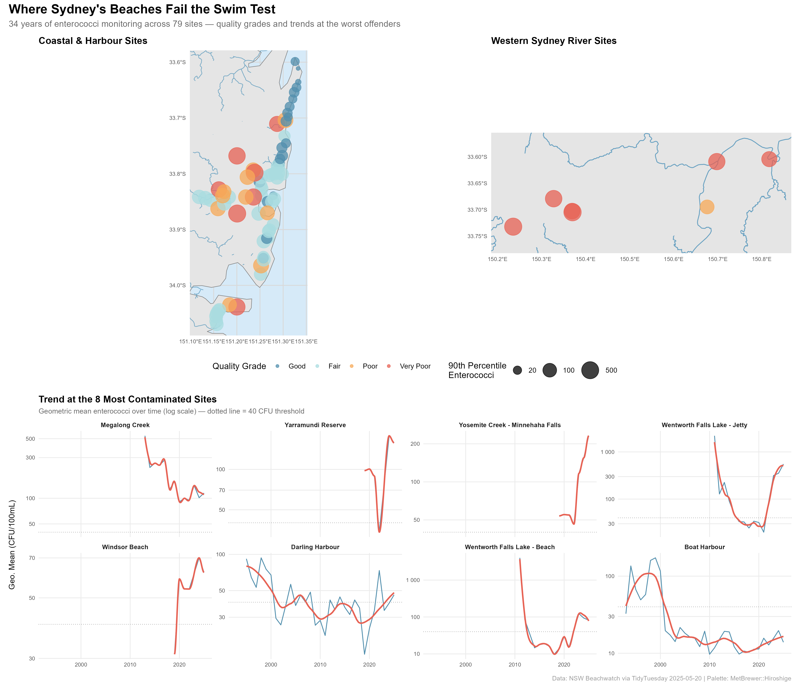

# Preface

From [TidyTuesday repository](https://github.com/rfordatascience/tidytuesday/blob/main/data/2025/2025-05-20/readme.md).

> This week's dataset explores water quality monitoring at Sydney's iconic beaches. The data comes from the NSW State Government's Beachwatch website, which monitors swim sites to "ensure that recreational water environments are managed as safely as possible."
>
> **Suggested questions:**
>
> - Has water quality declined over the 34-year period?
> - What correlation exists between rainfall and enterococci bacteria levels?
> - Do certain swimming locations show elevated bacteria levels after rain events?

## Loading necessary packages

My handy booster pack that allows me to install (if needed) and load my usual and favorite packages, as well as some helpful functions.

```{r}
#| label: booster-pack
#| message: false
#| warning: false
#| code-fold: true

# Packages ----------------------------------------------------------------

{
  # Install pak if it's not already installed
  if (!requireNamespace("pak", quietly = TRUE)) {
    install.packages(
      "pak",
      repos = sprintf(
        "https://r-lib.github.io/p/pak/stable/%s/%s/%s",
        .Platform$pkgType,
        R.Version()$os,
        R.Version()$arch
      )
    )
  }

  # CRAN Packages ----
  install_booster_pack <- function(package, load = TRUE) {
    for (pkg in package) {
      if (!requireNamespace(pkg, quietly = TRUE)) {
        pak::pkg_install(pkg)
      }
      if (load) {
        library(pkg, character.only = TRUE)
      }
    }
  }

  ## Packages ----

  booster_pack <- c(
    ### IO ----
    'fs',
    'here',
    'janitor',
    'rio',
    'tidyverse',

    ### EDA ----
    'skimr',

    ### Plot ----
    'paletteer',
    'ggrepel',
    'ggtext',
    'patchwork',
    'ggridges',

    ### Spatial ----
    'sf',
    'rnaturalearth',
    'osmdata',

    ### Misc ----
    'cowplot',
    'tidytuesdayR'
  )

  install_booster_pack(package = booster_pack, load = TRUE)
  rm(install_booster_pack, booster_pack)

  # Custom Functions ----

  `%ni%` <- Negate(`%in%`)

  geometric_mean <- function(x) {
    exp(mean(log(x[x > 0]), na.rm = TRUE))
  }

  my_skim <- skim_with(
    numeric = sfl(
      n = length,
      min = ~ min(.x, na.rm = T),
      p25 = ~ stats::quantile(., probs = .25, na.rm = TRUE, names = FALSE),
      med = ~ median(.x, na.rm = T),
      p75 = ~ stats::quantile(., probs = .75, na.rm = TRUE, names = FALSE),
      max = ~ max(.x, na.rm = T),
      mean = ~ mean(.x, na.rm = T),
      geo_mean = ~ geometric_mean(.x),
      sd = ~ stats::sd(., na.rm = TRUE),
      hist = ~ inline_hist(., 5)
    ),
    append = FALSE
  )
}


```

# Load raw data from package

```{r}
#| label: raw-data-load
#| echo: true
#| output: false

raw <- tidytuesdayR::tt_load('2025-05-20')

water_quality <- raw$water_quality
weather <- raw$weather

```

# Exploratory Data Analysis

The `my_skim()` function is a modified version of the `skimr::skim()` function that returns the number of missing data points (cells as `NA`) as well as the inverse (e.g.: number of rows that are *not* `NA`), the count, minimum, 25%, median, 75%, max, mean, geometric mean, and standard deviation. It also generates a little ASCII histogram. Neat!

## Water Quality

We have `r nrow(water_quality)` measurements across `r n_distinct(water_quality$swim_site)` swim sites in `r n_distinct(water_quality$region)` regions, spanning `r min(water_quality$date)` to `r max(water_quality$date)`.

Water temperature and conductivity have significant missingness (~60-64%), so we'll focus our analysis on the enterococci bacteria levels, which are nearly complete. The `time` column is also dropped since sampling time isn't central to our questions.

```{r}
#| label: eda-water-quality
#| echo: true
#| output: true

water_quality %>%
  select(-time, -water_temperature_c, -conductivity_ms_cm) %>%
  my_skim()

```

Enterococci levels are wildly right-skewed — the median is just 4 CFU/100mL but the mean is 117, with a max of 1.1 million. This tells us most samples are clean, but rare contamination events produce extreme spikes. We'll want to work on a log scale for most analyses.

::: {.callout-note}
## What is enterococci?
Enterococci are bacteria found in the intestines of warm-blooded animals. Their presence in beach water indicates fecal contamination — from stormwater runoff, sewage overflows, or animal waste. Australian guidelines consider levels above **40 CFU/100mL** as the threshold for "poor" water quality at marine beaches.
:::

## Weather

```{r}
#| label: eda-weather
#| echo: true
#| output: true

weather %>%
  select(-latitude, -longitude) %>%
  my_skim()

```

Daily weather data covering the same 34-year period. Precipitation is also right-skewed (median 0.1mm, max 135mm), with most days seeing little to no rain. The big rain events are what we'd expect to drive bacteria spikes.

## Joining the datasets

The water quality data has specific sample dates, while weather is daily. We'll join on date to associate each water sample with the day's rainfall — and also compute cumulative rainfall over the prior 1-3 days, since stormwater runoff has a lag effect.

```{r}
#| label: eda-join
#| echo: true
#| output: true

# Create lagged rainfall measures
weather_lagged <- weather %>%
  select(date, precipitation_mm) %>%
  arrange(date) %>%
  mutate(
    rain_1d = precipitation_mm,
    rain_2d = rain_1d + lag(precipitation_mm, 1, default = 0),
    rain_3d = rain_2d + lag(precipitation_mm, 2, default = 0)
  )

# Join water quality with weather
wq <- water_quality %>%
  select(-time, -water_temperature_c, -conductivity_ms_cm) %>%
  left_join(weather_lagged, by = "date") %>%
  mutate(
    year = year(date),
    month = month(date),
    season = case_when(
      month %in% c(12, 1, 2) ~ "Summer",
      month %in% c(3, 4, 5) ~ "Autumn",
      month %in% c(6, 7, 8) ~ "Winter",
      month %in% c(9, 10, 11) ~ "Spring"
    ),
    season = factor(season, levels = c("Summer", "Autumn", "Winter", "Spring")),
    log_entero = log10(enterococci_cfu_100ml + 1),
    rain_category = case_when(
      rain_3d == 0 ~ "No rain",
      rain_3d <= 5 ~ "Light (0-5mm)",
      rain_3d <= 20 ~ "Moderate (5-20mm)",
      rain_3d <= 50 ~ "Heavy (20-50mm)",
      TRUE ~ "Extreme (50mm+)"
    ),
    rain_category = factor(
      rain_category,
      levels = c(
        "No rain",
        "Light (0-5mm)",
        "Moderate (5-20mm)",
        "Heavy (20-50mm)",
        "Extreme (50mm+)"
      )
    )
  )

cat("Joined dataset:", nrow(wq), "rows\n")
cat("Date range:", as.character(range(wq$date)), "\n")
cat(
  "Rainfall match rate:",
  scales::percent(mean(!is.na(wq$precipitation_mm))),
  "\n"
)

```

# Site-Level Contamination Profiles

Which beaches are the worst offenders? We'll compute summary statistics at the site level — median enterococci, 90th percentile (the "bad day" metric), and the percentage of samples exceeding the 40 CFU/100mL safety threshold.

```{r}
#| label: domain-site-profiles
#| echo: true
#| output: true

site_stats <- wq %>%
  filter(!is.na(enterococci_cfu_100ml)) %>%
  group_by(region, council, swim_site, latitude, longitude) %>%
  summarise(
    n_samples = n(),
    median_entero = median(enterococci_cfu_100ml, na.rm = TRUE),
    p90_entero = quantile(enterococci_cfu_100ml, 0.9, na.rm = TRUE),
    geo_mean_entero = geometric_mean(enterococci_cfu_100ml),
    pct_exceedance = mean(enterococci_cfu_100ml > 40, na.rm = TRUE),
    max_entero = max(enterococci_cfu_100ml, na.rm = TRUE),
    .groups = "drop"
  ) %>%
  mutate(
    quality_grade = case_when(
      geo_mean_entero <= 10 & p90_entero <= 40 ~ "Good",
      geo_mean_entero <= 20 & p90_entero <= 100 ~ "Fair",
      geo_mean_entero <= 40 & p90_entero <= 200 ~ "Poor",
      TRUE ~ "Very Poor"
    ),
    quality_grade = factor(
      quality_grade,
      levels = c("Good", "Fair", "Poor", "Very Poor")
    )
  )

# Top 10 worst sites by exceedance rate
site_stats %>%
  arrange(desc(pct_exceedance)) %>%
  select(
    region,
    swim_site,
    n_samples,
    median_entero,
    p90_entero,
    pct_exceedance,
    quality_grade
  ) %>%
  head(10)

```

::: {.callout-important}
## The 40 CFU/100mL threshold
Australian recreational water quality guidelines (NHMRC 2008) set 40 CFU/100mL of enterococci as the "poor" threshold for marine waters. Levels above this indicate a substantially elevated risk of gastrointestinal illness for swimmers. We use this as our primary benchmark throughout.
:::

# 34-Year Trend Analysis

Has Sydney's beach water gotten cleaner or dirtier since 1991? We'll track the yearly geometric mean of enterococci by region — geometric mean is the standard metric for water quality because it dampens the influence of extreme spikes while still reflecting the central tendency of a log-normal distribution.

```{r}
#| label: domain-yearly-trends
#| echo: true
#| output: true

yearly_trends <- wq %>%
  filter(!is.na(enterococci_cfu_100ml), enterococci_cfu_100ml > 0) %>%
  group_by(year, region) %>%
  summarise(
    geo_mean = geometric_mean(enterococci_cfu_100ml),
    median_entero = median(enterococci_cfu_100ml),
    pct_exceedance = mean(enterococci_cfu_100ml > 40),
    n_samples = n(),
    .groups = "drop"
  )

# Overall trend across all sites
yearly_overall <- wq %>%
  filter(!is.na(enterococci_cfu_100ml), enterococci_cfu_100ml > 0) %>%
  group_by(year) %>%
  summarise(
    geo_mean = geometric_mean(enterococci_cfu_100ml),
    pct_exceedance = mean(enterococci_cfu_100ml > 40),
    .groups = "drop"
  )

cat("Overall geo mean trend:\n")
cat(
  "  1992:",
  round(yearly_overall$geo_mean[yearly_overall$year == 1992], 1),
  "\n"
)
cat(
  "  2024:",
  round(
    yearly_overall$geo_mean[yearly_overall$year == max(yearly_overall$year)],
    1
  ),
  "\n"
)

```

```{r}
#| label: viz-trend-lines
#| echo: true
#| message: false
#| warning: false
#| fig.width: 10
#| fig.height: 6

# Hiroshige palette — warm reds to ocean blues
hiroshige <- paletteer_d("MetBrewer::Hiroshige", n = 10)

# Pick 5 distinct colors for regions from the Hiroshige palette
region_colors <- setNames(
  as.character(hiroshige[c(1, 3, 6, 8, 10)]),
  c(
    "Western Sydney",
    "Sydney Harbour",
    "Sydney City",
    "Northern Sydney",
    "Southern Sydney"
  )
)

p_trend <- ggplot(yearly_trends, aes(x = year, y = geo_mean, color = region)) +
  geom_line(linewidth = 0.8, alpha = 0.7) +
  geom_smooth(se = FALSE, method = "loess", span = 0.3, linewidth = 1.2) +
  geom_hline(
    yintercept = 40,
    linetype = "dashed",
    color = "grey40",
    linewidth = 0.5
  ) +
  annotate(
    "text",
    x = 1993,
    y = 45,
    label = "40 CFU threshold",
    hjust = 0,
    vjust = -0.5,
    size = 3,
    color = "grey40"
  ) +
  scale_color_manual(values = region_colors) +
  scale_y_log10(labels = scales::comma_format()) +
  labs(
    title = "Sydney Beach Water Quality Over 34 Years",
    subtitle = "Geometric mean enterococci by region (log scale) — dashed line marks the 40 CFU/100mL safety threshold",
    x = NULL,
    y = "Geometric Mean Enterococci (CFU/100mL)",
    color = "Region"
  ) +
  theme_minimal(base_size = 12) +
  theme(
    plot.title = element_text(face = "bold", size = 14),
    plot.subtitle = element_text(color = "grey40", size = 10),
    legend.position = "bottom",
    panel.grid.minor = element_blank()
  )

p_trend

```

The trend lines reveal that most regions have shown improvement since the early 1990s, though the trajectory is uneven. Western Sydney — with its riverine swim sites rather than ocean beaches — consistently runs the highest bacteria levels. The Sydney Harbour sites have seen notable improvement, likely reflecting decades of infrastructure investment in sewage and stormwater management.

# Spatial Hotspot Map

Where are the dirtiest beaches? Using the site-level quality grades, we can map all 79 monitoring locations and see whether contamination clusters geographically.

```{r}
#| label: viz-hotspot-map
#| echo: true
#| message: false
#| warning: false
#| fig.width: 12
#| fig.height: 8

# Convert to sf for spatial plotting
site_sf <- site_stats %>%
  st_as_sf(coords = c("longitude", "latitude"), crs = 4326)

# Get Australia coastline for map context
aus <- ne_countries(scale = "large", country = "Australia", returnclass = "sf")

# Grade colors from Hiroshige — clean blues to contaminated reds
grade_colors <- setNames(
  as.character(hiroshige[c(8, 6, 3, 1)]),
  c("Good", "Fair", "Poor", "Very Poor")
)

# Split sites: coastal/harbour vs western Sydney rivers
coastal_sf <- site_sf %>% filter(region != "Western Sydney")
western_sf <- site_sf %>% filter(region == "Western Sydney")

# -- Coastal panel -- harbour & ocean beaches
coastal_bbox <- st_bbox(coastal_sf)
c_pad <- 0.02
c_xlim <- c(
  as.numeric(coastal_bbox["xmin"]) - c_pad,
  as.numeric(coastal_bbox["xmax"]) + c_pad
)
c_ylim <- c(
  as.numeric(coastal_bbox["ymin"]) - c_pad,
  as.numeric(coastal_bbox["ymax"]) + c_pad
)

# Fetch harbour waterways from OSM (tryCatch for API resilience)
coast_osm_bbox <- c(c_xlim[1], c_ylim[1], c_xlim[2], c_ylim[2])
coast_river_lines <- tryCatch(
  {
    q <- opq(bbox = coast_osm_bbox, timeout = 60) %>%
      add_osm_feature(key = "waterway", value = c("river", "canal")) %>%
      osmdata_sf()
    q$osm_lines
  },
  error = function(e) NULL
)

p_coast <- ggplot() +
  geom_sf(data = aus, fill = "grey90", color = "grey50", linewidth = 0.3) +
  {
    if (!is.null(coast_river_lines) && nrow(coast_river_lines) > 0) {
      geom_sf(
        data = coast_river_lines,
        color = "#4a90b8",
        linewidth = 0.4,
        alpha = 0.7
      )
    }
  } +
  geom_sf(
    data = coastal_sf,
    aes(color = quality_grade, size = p90_entero),
    alpha = 0.75
  ) +
  coord_sf(xlim = c_xlim, ylim = c_ylim, expand = FALSE) +
  scale_color_manual(values = grade_colors, drop = FALSE) +
  scale_size_continuous(
    range = c(2, 10),
    trans = "log10",
    breaks = c(20, 100, 500),
    limits = range(site_stats$p90_entero, na.rm = TRUE),
    labels = scales::comma_format(),
    name = "90th Percentile\nEnterococci"
  ) +
  labs(title = "Coastal & Harbour Sites", color = "Quality Grade") +
  theme_minimal(base_size = 11) +
  theme(
    plot.title = element_text(face = "bold", size = 12),
    panel.background = element_rect(fill = "#d6eaf8", color = NA),
    panel.grid = element_line(color = "grey85"),
    axis.text = element_text(size = 7)
  )

# -- Western Sydney panel -- fetch rivers from OpenStreetMap
western_bbox_vals <- st_bbox(western_sf)
w_pad <- 0.05
w_xlim <- c(
  as.numeric(western_bbox_vals["xmin"]) - w_pad,
  as.numeric(western_bbox_vals["xmax"]) + w_pad
)
w_ylim <- c(
  as.numeric(western_bbox_vals["ymin"]) - w_pad,
  as.numeric(western_bbox_vals["ymax"]) + w_pad
)

# Query OSM for rivers in the Western Sydney area (named rivers only)
osm_bbox <- c(w_xlim[1], w_ylim[1], w_xlim[2], w_ylim[2])
river_lines <- tryCatch(
  {
    q <- opq(bbox = osm_bbox, timeout = 60) %>%
      add_osm_feature(key = "waterway", value = c("river")) %>%
      osmdata_sf()
    q$osm_lines %>% filter(!is.na(name))
  },
  error = function(e) NULL
)

p_west <- ggplot() +
  geom_sf(data = aus, fill = "grey90", color = "grey50", linewidth = 0.3) +
  {
    if (!is.null(river_lines) && nrow(river_lines) > 0) {
      geom_sf(
        data = river_lines,
        color = "#4a90b8",
        linewidth = 0.5,
        alpha = 0.8
      )
    }
  } +
  geom_sf(
    data = western_sf,
    aes(color = quality_grade, size = p90_entero),
    alpha = 0.75
  ) +
  coord_sf(xlim = w_xlim, ylim = w_ylim, expand = FALSE) +
  scale_color_manual(values = grade_colors, drop = FALSE) +
  scale_size_continuous(
    range = c(2, 10),
    trans = "log10",
    breaks = c(20, 100, 500),
    limits = range(site_stats$p90_entero, na.rm = TRUE),
    labels = scales::comma_format(),
    name = "90th Percentile\nEnterococci"
  ) +
  labs(title = "Western Sydney River Sites", color = "Quality Grade") +
  theme_minimal(base_size = 11) +
  theme(
    plot.title = element_text(face = "bold", size = 12),
    panel.grid = element_line(color = "grey92"),
    axis.text = element_text(size = 7)
  )

# Combine maps — standalone version with legend
p_map <- p_coast +
  p_west +
  plot_layout(widths = c(1.4, 1), guides = "collect") +
  plot_annotation(
    title = "Sydney Swim Site Water Quality Grades",
    subtitle = "Color = overall quality grade | Size = 90th percentile enterococci (log scale)",
    caption = "Source: NSW Beachwatch via TidyTuesday | Grades based on NHMRC 2008 guidelines",
    theme = theme(
      plot.title = element_text(face = "bold", size = 14),
      plot.subtitle = element_text(color = "grey40", size = 10),
      plot.caption = element_text(color = "grey60", size = 8)
    )
  ) &
  theme(legend.position = "bottom")

p_map

```

The spatial pattern is striking — the "Very Poor" and "Poor" sites cluster along Sydney Harbour and Western Sydney's river systems, while the open ocean beaches along the northern and southern coasts tend to grade "Good" or "Fair." This makes physical sense: enclosed waterways with limited tidal flushing concentrate stormwater runoff, while exposed ocean beaches benefit from dilution and wave action.

# Hero Visualization: Hotspot Map + Sparkline Trends

```{r}
#| label: viz-hero
#| echo: true
#| message: false
#| warning: false
#| fig.width: 14
#| fig.height: 12

# Identify the 8 worst sites for sparkline panels
worst_sites <- site_stats %>%
  arrange(desc(pct_exceedance)) %>%
  slice_head(n = 8) %>%
  pull(swim_site)

# Yearly geo mean for the worst sites
worst_trends <- wq %>%
  filter(
    swim_site %in% worst_sites,
    !is.na(enterococci_cfu_100ml),
    enterococci_cfu_100ml > 0
  ) %>%
  group_by(swim_site, year) %>%
  summarise(
    geo_mean = geometric_mean(enterococci_cfu_100ml),
    .groups = "drop"
  ) %>%
  mutate(swim_site = factor(swim_site, levels = worst_sites))

# Sparkline panel
p_spark <- ggplot(worst_trends, aes(x = year, y = geo_mean)) +
  geom_line(color = as.character(hiroshige[8]), linewidth = 0.5) +
  geom_smooth(
    se = FALSE,
    method = "loess",
    span = 0.4,
    color = as.character(hiroshige[1]),
    linewidth = 0.9
  ) +
  geom_hline(
    yintercept = 40,
    linetype = "dotted",
    color = "grey50",
    linewidth = 0.3
  ) +
  facet_wrap(~swim_site, ncol = 4, scales = "free_y") +
  scale_y_log10(labels = scales::label_number(accuracy = 1)) +
  labs(
    title = "Trend at the 8 Most Contaminated Sites",
    subtitle = "Geometric mean enterococci over time (log scale) — dotted line = 40 CFU threshold",
    x = NULL,
    y = "Geo. Mean (CFU/100mL)"
  ) +
  theme_minimal(base_size = 10) +
  theme(
    plot.title = element_text(face = "bold", size = 12),
    plot.subtitle = element_text(color = "grey40", size = 9),
    strip.text = element_text(face = "bold", size = 8),
    panel.grid.minor = element_blank(),
    axis.text = element_text(size = 7)
  )

# Build legend and legend-stripped maps for hero layout
hero_legend <- cowplot::get_legend(
  p_coast + theme(legend.position = "bottom")
)
p_map_bare <- (p_coast + p_west + plot_layout(widths = c(1.4, 1))) &
  theme(legend.position = "none")

# Combine: maps on top, shared legend, sparklines below
hero <- (p_map_bare / wrap_elements(hero_legend) / p_spark) +
  plot_layout(heights = c(5, 0.6, 4)) +
  plot_annotation(
    title = "Where Sydney's Beaches Fail the Swim Test",
    subtitle = "34 years of enterococci monitoring across 79 sites — quality grades and trends at the worst offenders",
    caption = "Data: NSW Beachwatch via TidyTuesday 2025-05-20 | Palette: MetBrewer::Hiroshige",
    theme = theme(
      plot.title = element_text(face = "bold", size = 16),
      plot.subtitle = element_text(color = "grey40", size = 11),
      plot.caption = element_text(color = "grey60", size = 8)
    )
  )


```

```{r}
#| label: save-hero
#| echo: false
#| output: false

ggsave(
  here::here("posts", "2025-05-20-water-quality-at-sydney-beaches", "hero.png"),
  plot = hero,
  width = 14,
  height = 12,
  units = "in",
  dpi = 320,
  bg = "white"
)

```




# Final thoughts and takeaways

Thirty-four years of monitoring paint a clear picture: **Sydney's ocean beaches are generally safe, but its harbour and river swim sites remain stubbornly contaminated.** The spatial divide isn't subtle — open-coast sites in Northern and Southern Sydney consistently grade "Good," while enclosed waterway sites in Western Sydney and parts of Sydney Harbour regularly exceed the 40 CFU/100mL safety threshold.

The trend data offers cautious optimism. Most regions show declining geometric mean enterococci since the early 1990s, reflecting real improvements in sewage infrastructure and stormwater management. But the worst sites — places like Windsor Beach, Northbridge Baths, and the harbour swimming spots — still spike hard after heavy rain. The underlying vulnerability hasn't been engineered away; it's been managed down.

This matters because these aren't abstract numbers. Every sample above 40 CFU/100mL represents a day when swimming carried a meaningfully elevated risk of gastrointestinal illness. The beaches that fail most often tend to be the ones closest to dense urban areas — the places where people are most likely to swim.

The takeaway isn't that Sydney's beaches are dangerous. By global standards, the monitoring program is exemplary and most sites are genuinely clean. But the gap between the best and worst sites is enormous, and that gap maps almost perfectly onto geography: open ocean vs. enclosed waterway. If you're picking a swim spot after rain, check the Beachwatch data — and maybe skip the harbour.

```{r}
#| label: palette-log
#| echo: false
#| output: false

palette_log_path <- here::here("posts", "palette-log.csv")
palette_log <- read.csv(palette_log_path)
new_entry <- data.frame(
  post_date = "2026-02-20",
  palette = "Hiroshige",
  package = "MetBrewer",
  type = "discrete"
)
if (
  !any(
    palette_log$post_date == new_entry$post_date &
      palette_log$palette == new_entry$palette
  )
) {
  write.table(
    new_entry,
    palette_log_path,
    append = TRUE,
    sep = ",",
    row.names = FALSE,
    col.names = FALSE
  )
}

```
