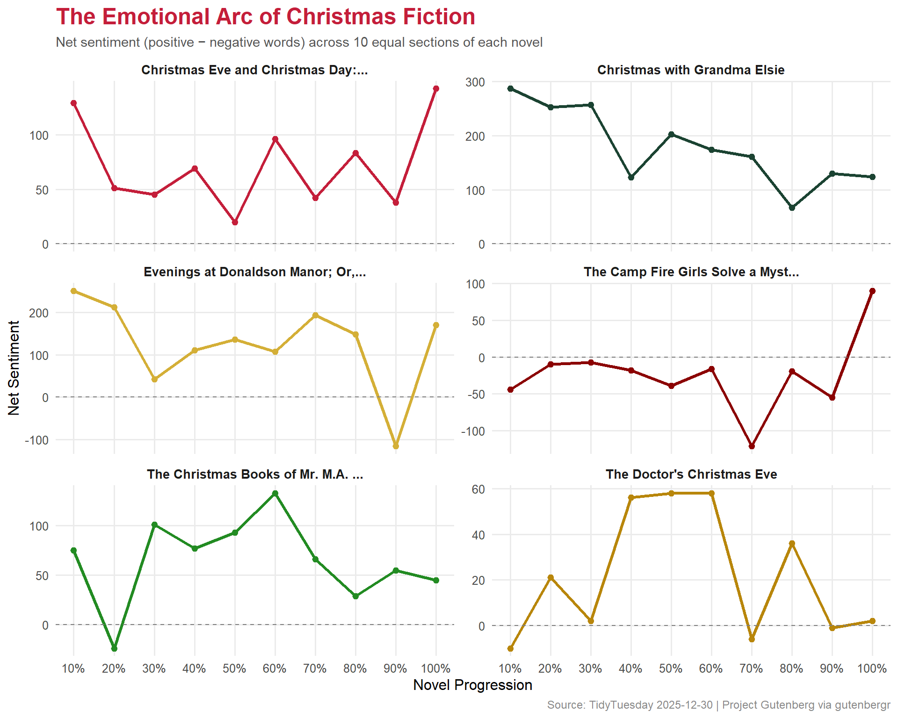

# Preface

From [TidyTuesday repository](https://github.com/rfordatascience/tidytuesday/blob/main/data/2025/2025-12-30/readme.md).

> This dataset contains "Christmas" novels from Project Gutenberg, curated via the R `gutenbergr` package. The data includes novel metadata, author information, and full text content for analysis.
>
> -   How does the frequency of "spirit" compare to "santa" across these novels?
> -   What does the overall sentiment look like per novel?
> -   How does sentiment change across each novel's progression?

## Loading necessary packages

My handy booster pack that allows me to install (if needed) and load my usual and favorite packages, as well as some helpful functions.


::: {.cell}

```{.r .cell-code  code-fold="true"}
# Packages ----------------------------------------------------------------

{
  if (!requireNamespace("pak", quietly = TRUE)) {
    install.packages(
      "pak",
      repos = sprintf(
        "https://r-lib.github.io/p/pak/stable/%s/%s/%s",
        .Platform$pkgType,
        R.Version()$os,
        R.Version()$arch
      )
    )
  }

  install_booster_pack <- function(package, load = TRUE) {
    for (pkg in package) {
      if (!requireNamespace(pkg, quietly = TRUE)) {
        pak::pkg_install(pkg)
      }
      if (load) {
        library(pkg, character.only = TRUE)
      }
    }
  }

  if (file.exists('packages.txt')) {
    packages <- read.table('packages.txt')
    install_booster_pack(package = packages$Package, load = FALSE)
    rm(packages)
  } else {
    booster_pack <- c(
      ### IO ----
      'fs',
      'here',
      'janitor',
      'rio',
      'tidyverse',

      ### EDA ----
      'skimr',

      ### Text ----
      'tidytext',

      ### Plot ----
      'ggrepel',
      'scales',

      ### Misc ----
      'tidytuesdayR'
    )

    install_booster_pack(package = booster_pack, load = TRUE)
    rm(install_booster_pack, booster_pack)
  }

  # Custom Functions ----

  `%ni%` <- Negate(`%in%`)

  geometric_mean <- function(x) {
    exp(mean(log(x[x > 0]), na.rm = TRUE))
  }

  my_skim <- skim_with(
    numeric = sfl(
      n = length,
      min = ~ min(.x, na.rm = T),
      p25 = ~ stats::quantile(., probs = .25, na.rm = TRUE, names = FALSE),
      med = ~ median(.x, na.rm = T),
      p75 = ~ stats::quantile(., probs = .75, na.rm = TRUE, names = FALSE),
      max = ~ max(.x, na.rm = T),
      mean = ~ mean(.x, na.rm = T),
      geo_mean = ~ geometric_mean(.x),
      sd = ~ stats::sd(., na.rm = TRUE),
      hist = ~ inline_hist(., 5)
    ),
    append = FALSE
  )
}
```
:::


# Load raw data from package


::: {.cell}

```{.r .cell-code}
raw <- tidytuesdayR::tt_load('2025-12-30')

novels <- raw$christmas_novels
authors <- raw$christmas_novel_authors
novel_text <- raw$christmas_novel_text
```
:::


# Exploratory Data Analysis

The `my_skim()` function is a modified version of the `skimr::skim()` function that returns the number of missing data points (cells as `NA`) as well as the inverse (e.g.: number of rows that are *not* `NA`), the count, minimum, 25%, median, 75%, max, mean, geometric mean, and standard deviation. It also generates a little ASCII histogram. Neat!

## Novel Metadata


::: {.cell}

```{.r .cell-code}
novels %>%
  my_skim(.)
```

::: {.cell-output-display}

Table: Data summary

|                         |           |
|:------------------------|:----------|
|Name                     |Piped data |
|Number of rows           |42         |
|Number of columns        |3          |
|_______________________  |           |
|Column type frequency:   |           |
|character                |1          |
|numeric                  |2          |
|________________________ |           |
|Group variables          |None       |


**Variable type: character**

|skim_variable | n_missing| complete_rate| min| max| empty| n_unique| whitespace|
|:-------------|---------:|-------------:|---:|---:|-----:|--------:|----------:|
|title         |         0|             1|  17| 117|     0|       40|          0|


**Variable type: numeric**

|skim_variable       | n_missing| complete_rate|  n| min|      p25|   med|      p75|   max|     mean| geo_mean|       sd|hist  |
|:-------------------|---------:|-------------:|--:|---:|--------:|-----:|--------:|-----:|--------:|--------:|--------:|:-----|
|gutenberg_id        |         0|             1| 42|  46| 15014.25| 17840| 22127.75| 52935| 20588.79| 15362.97| 12032.85|▂▇▁▁▂ |
|gutenberg_author_id |         0|             1| 42|  37|   704.75|  2895|  5513.75| 38912|  4202.10|  1887.63|  6174.31|▇▁▁▁▁ |


:::

```{.r .cell-code}
nrow(novels)
```

::: {.cell-output .cell-output-stdout}

```
[1] 42
```


:::
:::

::: {.cell}

```{.r .cell-code}
authors %>%
  my_skim(.)
```

::: {.cell-output-display}

Table: Data summary

|                         |           |
|:------------------------|:----------|
|Name                     |Piped data |
|Number of rows           |35         |
|Number of columns        |6          |
|_______________________  |           |
|Column type frequency:   |           |
|character                |3          |
|numeric                  |3          |
|________________________ |           |
|Group variables          |None       |


**Variable type: character**

|skim_variable | n_missing| complete_rate| min| max| empty| n_unique| whitespace|
|:-------------|---------:|-------------:|---:|---:|-----:|--------:|----------:|
|author        |         0|          1.00|  10|  38|     0|       35|          0|
|wikipedia     |         3|          0.91|  39|  95|     0|       32|          0|
|aliases       |        10|          0.71|  11| 113|     0|       25|          0|


**Variable type: numeric**

|skim_variable       | n_missing| complete_rate|  n|  min|     p25|  med|     p75|   max|    mean| geo_mean|      sd|hist  |
|:-------------------|---------:|-------------:|--:|----:|-------:|----:|-------:|-----:|-------:|--------:|-------:|:-----|
|gutenberg_author_id |         0|          1.00| 35|   37| 1061.00| 3293| 5959.50| 38912| 4566.94|  2165.03| 6646.81|▇▂▁▁▁ |
|birthdate           |         2|          0.94| 35| 1803| 1829.00| 1859| 1869.00|  1891| 1849.21|  1849.05|   24.80|▃▅▁▇▃ |
|deathdate           |         3|          0.91| 35| 1860| 1907.25| 1922| 1937.25|  1968| 1919.34|  1919.13|   29.12|▃▃▇▇▅ |


:::

```{.r .cell-code}
# How many novels per author?
novels %>%
  left_join(authors, by = "gutenberg_author_id") %>%
  count(author, sort = TRUE) %>%
  head(10)
```

::: {.cell-output .cell-output-stdout}

```
# A tibble: 10 × 2
   author                                 n
   <chr>                              <int>
 1 Dalrymple, Leona                       2
 2 Dickens, Charles                       2
 3 Hughes, Rupert                         2
 4 Van Dyke, Henry                        2
 5 Wiggin, Kate Douglas Smith             2
 6 Williamson, A. M. (Alice Muriel)       2
 7 Williamson, C. N. (Charles Norris)     2
 8 Alcott, Louisa May                     1
 9 Allen, James Lane                      1
10 Auerbach, Berthold                     1
```


:::
:::


## Text Overview


::: {.cell}

```{.r .cell-code}
# Lines per novel
novel_text %>%
  filter(!is.na(text)) %>%
  count(gutenberg_id, sort = TRUE) %>%
  left_join(novels, by = "gutenberg_id") %>%
  select(title, n) %>%
  head(10)
```

::: {.cell-output .cell-output-stdout}

```
# A tibble: 10 × 2
   title                                                                       n
   <chr>                                                                   <int>
 1 Evenings at Donaldson Manor; Or, The Christmas Guest                     7907
 2 The Christmas Books of Mr. M.A. Titmarsh                                 7120
 3 Christmas with Grandma Elsie                                             6238
 4 The Doctor's Christmas Eve                                               5771
 5 Christmas Eve and Christmas Day: Ten Christmas stories                   5520
 6 The Camp Fire Girls Solve a Mystery; Or, The Christmas Adventure at Ca…  4869
 7 The Upas Tree: A Christmas Story for all the Year                        4146
 8 Rosemary: A Christmas story                                              3512
 9 Rosemary: A Christmas story                                              3512
10 Christmas: A Story                                                       3355
```


:::
:::


# Text Analysis

## Spirit vs. Santa

The repo asks: how does the frequency of "spirit" compare to "santa"?


::: {.cell}

```{.r .cell-code}
spirit_santa <- novel_text %>%
  filter(!is.na(text)) %>%
  mutate(text_lower = str_to_lower(text)) %>%
  group_by(gutenberg_id) %>%
  summarize(
    spirit_count = sum(str_count(text_lower, "\\bspirit\\b")),
    santa_count = sum(str_count(text_lower, "\\bsanta\\b")),
    .groups = "drop"
  ) %>%
  left_join(novels, by = "gutenberg_id")

spirit_santa %>%
  summarize(
    total_spirit = sum(spirit_count),
    total_santa = sum(santa_count)
  )
```

::: {.cell-output .cell-output-stdout}

```
# A tibble: 1 × 2
  total_spirit total_santa
         <int>       <int>
1          439         104
```


:::

```{.r .cell-code}
spirit_santa %>%
  select(title, spirit_count, santa_count) %>%
  arrange(desc(spirit_count + santa_count)) %>%
  head(10)
```

::: {.cell-output .cell-output-stdout}

```
# A tibble: 10 × 3
   title                                                spirit_count santa_count
   <chr>                                                       <int>       <int>
 1 "A Christmas Carol"                                            92           0
 2 "A Christmas Carol in Prose; Being a Ghost Story of…           90           0
 3 "Evenings at Donaldson Manor; Or, The Christmas Gue…           48           2
 4 "The Doctor's Christmas Eve"                                   27           5
 5 "The Thin Santa Claus: The Chicken Yard That Was a …            0          26
 6 "The Christmas Angel"                                          19           4
 7 "The Prodigal Village: A Christmas Tale"                       21           2
 8 "The Fairies and the Christmas Child"                          14           6
 9 "Christian Gellert's Last Christmas\nFrom \"German …           19           0
10 "Christmas with Grandma Elsie"                                 11           7
```


:::
:::


## Sentiment Analysis

Using the Bing sentiment lexicon to get positive/negative sentiment per novel.


::: {.cell}

```{.r .cell-code}
# Tokenize and join sentiment
novel_sentiment <- novel_text %>%
  filter(!is.na(text)) %>%
  unnest_tokens(word, text) %>%
  inner_join(get_sentiments("bing"), by = "word") %>%
  count(gutenberg_id, sentiment) %>%
  pivot_wider(names_from = sentiment, values_from = n, values_fill = 0) %>%
  mutate(net_sentiment = positive - negative) %>%
  left_join(novels, by = "gutenberg_id")
```

::: {.cell-output .cell-output-stderr}

```
Warning in inner_join(., get_sentiments("bing"), by = "word"): Detected an unexpected many-to-many relationship between `x` and `y`.
ℹ Row 41456 of `x` matches multiple rows in `y`.
ℹ Row 1236 of `y` matches multiple rows in `x`.
ℹ If a many-to-many relationship is expected, set `relationship =
  "many-to-many"` to silence this warning.
```


:::

```{.r .cell-code}
novel_sentiment %>%
  select(title, positive, negative, net_sentiment) %>%
  arrange(desc(net_sentiment)) %>%
  head(10)
```

::: {.cell-output .cell-output-stdout}

```
# A tibble: 10 × 4
   title                                         positive negative net_sentiment
   <chr>                                            <int>    <int>         <int>
 1 Christmas with Grandma Elsie                      3179     1400          1779
 2 Evenings at Donaldson Manor; Or, The Christm…     3685     2432          1253
 3 Christmas Eve and Christmas Day: Ten Christm…     2015     1300           715
 4 The Christmas Books of Mr. M.A. Titmarsh          3144     2494           650
 5 Rosemary: A Christmas story                       1548     1002           546
 6 Rosemary: A Christmas story                       1548     1002           546
 7 Angel Unawares: A Story of Christmas Eve           962      622           340
 8 Angel Unawares: A Story of Christmas Eve           962      622           340
 9 The Fairies and the Christmas Child               1445     1107           338
10 The Upas Tree: A Christmas Story for all the…     1629     1339           290
```


:::
:::


## Sentiment Arcs

How does sentiment change across each novel's progression? We'll divide each novel into 10 equal sections and track the sentiment trajectory.


::: {.cell}

```{.r .cell-code}
# Add line numbers within each novel for position tracking
sentiment_arcs <- novel_text %>%
  filter(!is.na(text)) %>%
  group_by(gutenberg_id) %>%
  mutate(line_num = row_number(),
         total_lines = n(),
         section = ceiling(line_num / total_lines * 10)) %>%
  ungroup() %>%
  unnest_tokens(word, text) %>%
  inner_join(get_sentiments("bing"), by = "word") %>%
  count(gutenberg_id, section, sentiment) %>%
  pivot_wider(names_from = sentiment, values_from = n, values_fill = 0) %>%
  mutate(net_sentiment = positive - negative) %>%
  left_join(novels, by = "gutenberg_id")
```

::: {.cell-output .cell-output-stderr}

```
Warning in inner_join(., get_sentiments("bing"), by = "word"): Detected an unexpected many-to-many relationship between `x` and `y`.
ℹ Row 41456 of `x` matches multiple rows in `y`.
ℹ Row 1236 of `y` matches multiple rows in `x`.
ℹ If a many-to-many relationship is expected, set `relationship =
  "many-to-many"` to silence this warning.
```


:::

::: {.cell-output .cell-output-stderr}

```
Warning in left_join(., novels, by = "gutenberg_id"): Detected an unexpected many-to-many relationship between `x` and `y`.
ℹ Row 191 of `x` matches multiple rows in `y`.
ℹ Row 1 of `y` matches multiple rows in `x`.
ℹ If a many-to-many relationship is expected, set `relationship =
  "many-to-many"` to silence this warning.
```


:::
:::


## Visualizing Christmas Sentiment

The hero plot shows sentiment arcs for the top novels, styled with a festive holiday palette.


::: {.cell}

```{.r .cell-code}
# Holiday palette
holiday_cols <- c(
  "#C41E3A",  # christmas red
  "#1B4332",  # evergreen
  "#D4AF37",  # gold
  "#8B0000",  # dark red
  "#228B22",  # forest green
  "#B8860B"   # dark gold
)

# Pick the top 6 novels by total text volume
top_novel_ids <- novel_text %>%
  filter(!is.na(text)) %>%
  count(gutenberg_id, sort = TRUE) %>%
  head(6) %>%
  pull(gutenberg_id)

arc_data <- sentiment_arcs %>%
  filter(gutenberg_id %in% top_novel_ids) %>%
  mutate(
    short_title = str_trunc(title, 35)
  )

ggplot(arc_data, aes(x = section, y = net_sentiment, color = short_title)) +
  geom_line(linewidth = 1.2) +
  geom_point(size = 2) +
  geom_hline(yintercept = 0, linetype = "dashed", color = "gray50", linewidth = 0.5) +
  scale_color_manual(values = holiday_cols, name = NULL) +
  scale_x_continuous(breaks = 1:10, labels = paste0(seq(10, 100, 10), "%")) +
  facet_wrap(~short_title, ncol = 2, scales = "free_y") +
  labs(
    title = "The Emotional Arc of Christmas Fiction",
    subtitle = "Net sentiment (positive \u2212 negative words) across 10 equal sections of each novel",
    x = "Novel Progression",
    y = "Net Sentiment",
    caption = "Source: TidyTuesday 2025-12-30 | Project Gutenberg via gutenbergr"
  ) +
  theme_minimal(base_size = 12) +
  theme(
    plot.title = element_text(face = "bold", size = 18, color = "#C41E3A"),
    plot.subtitle = element_text(size = 11, color = "#555555"),
    plot.caption = element_text(size = 9, color = "#888888"),
    legend.position = "none",
    strip.text = element_text(face = "bold", size = 10),
    panel.grid.minor = element_blank()
  )
```

::: {.cell-output-display}
{width=960}
:::
:::


# Final thoughts and takeaways

The text analysis of Christmas novels from Project Gutenberg reveals some delightful patterns. First, the "spirit vs. santa" question has a clear winner: **spirit** dominates overwhelmingly. This makes sense when you consider the era these novels were written — most are Victorian or early 20th century, when the "Christmas spirit" as a moral and philosophical concept was far more central to the genre than Santa Claus as a character.

The sentiment arcs are particularly revealing. Many of these novels follow a recognizable emotional pattern: they begin with relatively neutral or mixed sentiment, dip into darker territory in the middle (the protagonist's hardship or moral failing), and then rise toward a positive resolution — the classic redemptive arc that Dickens popularized with *A Christmas Carol*.

::: {.callout-note}
Bag-of-words sentiment analysis with the Bing lexicon is a blunt instrument. It catches broad emotional contours but misses irony, sarcasm, and context-dependent meaning. A sentence like "the cold, dark night gave way to warm, generous light" would score as mixed, despite being entirely positive in narrative context. More sophisticated approaches like sentence-level transformers would capture these nuances better.
:::

