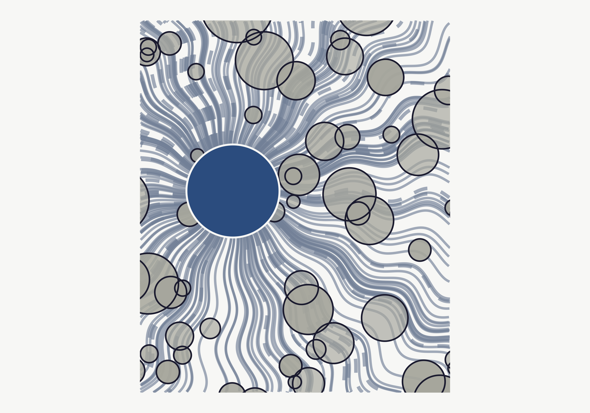

```{=html}
<style>
  /* Chemist's Bench Theme: iron_gall */
  :root {
    --cb-primary: #1a1a2e;
    --cb-secondary: #4a5568;
    --cb-accent: #718096;
    --cb-background: #f7f7f5;
    --cb-surface: #edf2f7;
    --cb-text: #1a1a2e;
    --cb-text-muted: #718096;
    --cb-link: #2b4c7e;
    --cb-link-hover: #1a1a2e;
    --cb-code-bg: #edf2f7;
    --cb-code-text: #1a1a2e;
    --cb-border: #cbd5e0;
    --cb-gradient: linear-gradient(135deg, #1a1a2e, #4a5568);
  }

  .quarto-body a {
    color: var(--cb-link);
  }
  .quarto-body a:hover {
    color: var(--cb-link-hover);
  }
  .quarto-body h1, .quarto-body h2, .quarto-body h3 {
    color: var(--cb-primary);
  }
  .quarto-body code {
    background-color: var(--cb-code-bg);
    color: var(--cb-code-text);
  }
  .quarto-body .callout {
    border-left-color: var(--cb-accent);
  }
  .quarto-title-block {
    border-top: 4px solid var(--cb-primary);
    padding-top: 0.5rem;
  }
</style>
```

[Laura Summers](https://github.com/summerscope) recently published
[The Human-in-the-Loop is Tired](https://pydantic.dev/articles/the-human-in-the-loop-is-tired)
on the Pydantic blog, and it got me thinking.

## The Argument

Summers writes from inside the Pydantic team — the people building the
validation, agent, and observability tools that underpin a huge chunk of the
Python AI ecosystem — and her central claim is disarmingly honest: working
with LLMs is genuinely useful *and* genuinely destabilizing, and pretending
the second part isn't happening is a path to burnout.

She frames the core problem as a broken reward function. Writing code by
hand was full of small dopamine hits — solving a problem, understanding a
piece of logic, watching things compile. LLM-assisted development has
automated the satisfying parts and replaced them with the cognitive load of
supervision: holding intent in your head while reviewing volumes of
mostly-correct output. The satisfying part shrank, the exhausting part grew,
and nothing new filled the gap.

She draws an analogy to the responsive design transition of the early 2010s,
when designers had to abandon pixel-perfect control and learn to design for
fluid, uncertain layouts. The craft didn't die — it evolved. The core skills
(proportion, hierarchy, systems thinking) mattered more, not less. She
argues the same pattern is playing out now with code: taste, architectural
judgment, and genuine expertise become *more* valuable as the volume of
plausible-looking output increases.

## Where I Agree

{EXPAND: The reward function framing resonates — connect to your own
experience. The dopamine of solving something in R vs. the fatigue of
reviewing Claude Code output. The "supervision fatigue" concept maps
directly to your experience building skills and workflows.

The isolation point is worth engaging with too — prompting is solitary in a
way that pair programming or code review isn't. How does this land for you
as someone who works on federal data projects where collaboration and
review are baked into the process?

The "what survives" section — taste, architectural judgment, the ability to
know what good looks like — does this match your experience with water
quality data harmonization? You know when the NER output is wrong because
you understand the domain. The model doesn't.}

## Where I Push Back

{EXPAND: A few possible angles —

1. The piece is written from the perspective of someone building web apps
   and frameworks. Does the reward function problem feel different when
   your domain is data science / environmental science? The "small
   rewards" in your work might be different — a clean join, a
   visualization that reveals something, a pipeline that runs without
   error. Are those being automated away in the same way?

2. The responsive design analogy is elegant but maybe too optimistic about
   timescales. She acknowledges this ("years vs. months") but doesn't
   fully grapple with what that compression means for people trying to
   adapt.

3. The piece doesn't engage with the skill *creation* side — building
   workflows, AGENTS.md files, skills that encode your judgment. She
   mentions it briefly (the engineer who extracted code review rules) but
   doesn't explore how that changes the loop. You're literally doing
   this — building tidy-tuesday and blog-post skills that encode your
   preferences and standards. That's not just supervision; it's a
   different kind of authorship.}

## What I'd Add

{EXPAND: Your unique angle here is that you're not just *using* AI tools —
you're building the scaffolding that shapes how AI tools work for you.
The skill system, the CLAUDE.md, the autonomous mode flags, the Chemist's
Bench theme system — these are all attempts to make the loop less
exhausting by encoding your judgment upfront.

Is there something to say about the difference between "human in the loop"
(reactive, supervisory) and "human as the loop designer" (proactive,
architectural)? The first is exhausting. The second might be where the
craft goes.

The anxiety dream about uploading petabytes of data — does that connect
to the trust/control tension she's describing?

Also: she doesn't address the non-software-engineer perspective much.
Your work sits at the intersection of environmental science and data
science. The "what survives" question looks different when domain
expertise *is* the moat, not just taste in code architecture.}

## The Upshot

{EXPAND: 2-3 sentences. What's your takeaway? Is the loop fixable, or is
the exhaustion structural? What should someone who reads both pieces walk
away thinking about?}


