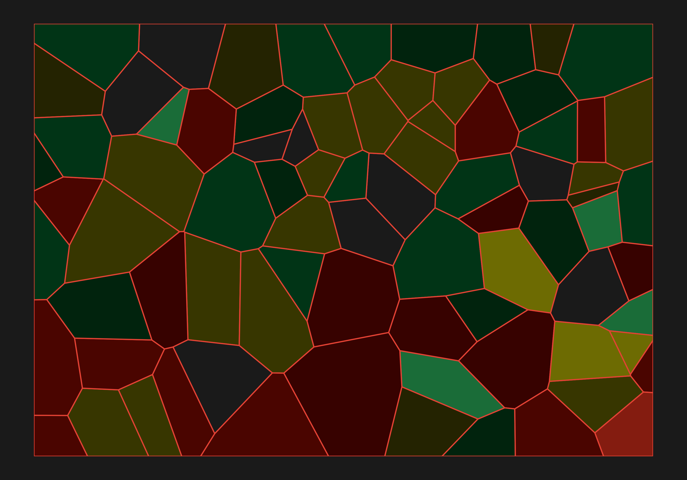

```{=html}
<style>
  /* Chemist's Bench: Toxic Victorian (dramatic, dangerous, opulent) */
  /* Generated by chemists_bench.R — do not hand-edit */

  /* --- CSS Custom Properties --- */
  #quarto-document-content {
    --cb-primary:     #50C878;
    --cb-secondary:   #E6E200;
    --cb-accent:      #E34234;
    --cb-background:  #1a1a1a;
    --cb-surface:     #2a2a2a;
    --cb-text:        #e0e0e0;
    --cb-text-muted:  #a0a0a0;
    --cb-heading:     #90EE90;
    --cb-link:        #50C878;
    --cb-link-hover:  #E6E200;
    --cb-code-bg:     #0a0a0a;
    --cb-code-text:   #50C878;
    --cb-border:      #404040;
    --cb-gradient:    linear-gradient(135deg, #50C878, #E6E200, #E34234);
  }

  /* === FULL-PAGE DARK COVERAGE === */
  /* Paint everything below (and including) navbar */
  body {
    background-color: #1a1a1a;
  }

  /* Navbar: blend with dark page */
  #quarto-header {
    background-color: #0a0a0a;
    border-bottom: 1px solid #404040;
  }
  #quarto-header .navbar {
    background-color: #0a0a0a;
  }
  #quarto-header .navbar-brand,
  #quarto-header .nav-link,
  #quarto-header .navbar a {
    color: #e0e0e0;
  }
  #quarto-header .nav-link:hover,
  #quarto-header .navbar a:hover {
    color: #50C878;
  }
  /* Quarto search icon */
  #quarto-header .quarto-navigation-tool {
    color: #a0a0a0;
  }

  /* Content area — no white gaps */
  #quarto-content {
    background-color: #1a1a1a;
  }

  /* Footer */
  .footer, footer.footer {
    background-color: #0a0a0a;
    border-top: 1px solid #404040;
    color: #a0a0a0;
  }
  .footer a {
    color: #50C878;
  }

  /* === ARTICLE BODY === */
  #quarto-document-content {
    background-color: #1a1a1a;
    color: #e0e0e0;
  }

  /* Headings — override global $headings-color: #1A2E35 */
  #quarto-document-content h1,
  #quarto-document-content h2,
  #quarto-document-content h3,
  #quarto-document-content h4,
  #quarto-document-content h5,
  #quarto-document-content h6 {
    color: #90EE90;
  }

  /* Links */
  #quarto-document-content a {
    color: #50C878;
  }
  #quarto-document-content a:hover {
    color: #E6E200;
  }

  /* Muted text */
  #quarto-document-content .text-muted,
  #quarto-document-content .subtitle,
  #quarto-document-content figcaption {
    color: #a0a0a0;
  }

  /* Code blocks */
  #quarto-document-content pre,
  #quarto-document-content div.sourceCode {
    background-color: #0a0a0a;
    border: 1px solid #404040;
  }
  #quarto-document-content code {
    color: #50C878;
  }
  #quarto-document-content pre > code.sourceCode {
    background-color: transparent;
  }

  /* Callouts */
  #quarto-document-content .callout {
    border-left-color: #E34234;
    background-color: #2a2a2a;
    color: #e0e0e0;
  }

  /* Blockquotes */
  #quarto-document-content blockquote {
    border-left-color: #E34234;
    color: #a0a0a0;
  }

  /* Tables */
  #quarto-document-content table {
    border-color: #404040;
  }
  #quarto-document-content th {
    background-color: #2a2a2a;
    color: #90EE90;
    border-color: #404040;
  }
  #quarto-document-content td {
    border-color: #404040;
  }

  /* Horizontal rules */
  #quarto-document-content hr {
    border-color: #404040;
  }

  /* Title block */
  .quarto-title-block {
    border-top: 4px solid #50C878;
    padding-top: 0.5rem;
  }
  #quarto-document-content .quarto-title {
    color: #90EE90;
  }
  #quarto-document-content .description {
    color: #a0a0a0;
  }
  .quarto-title-meta-heading,
  .quarto-title-meta-contents {
    color: #a0a0a0;
  }
  .quarto-title-meta-contents a {
    color: #50C878;
  }

  /* Category badges */
  .quarto-title-block .quarto-category {
    background-color: #2a2a2a;
    color: #50C878;
    border-color: #404040;
  }

  /* Sidebar TOC */
  #quarto-margin-sidebar {
    color: #a0a0a0;
  }
  #quarto-margin-sidebar .sidebar-title {
    color: #e0e0e0;
  }
  #quarto-margin-sidebar a {
    color: #a0a0a0;
  }
  #quarto-margin-sidebar a:hover,
  #quarto-margin-sidebar a.active {
    color: #50C878;
  }
  #quarto-margin-sidebar .toc-actions a {
    color: #a0a0a0;
  }
</style>
```

[Roya Pakzad](https://royapakzad.substack.com/) recently published
[Multilingual LLM Evaluation to Guardrails](https://royapakzad.substack.com/p/multilingual-llm-evaluation-to-guardrails),
and the Farsi proverb at the end of her piece has not left my thinking since.

> *«هر چه بگندد نمکش می‌زنند، وای به روزی که بگندد نمک»* 
> 
> *If something spoils, you add salt to fix it. But woe to the day the salt itself has spoiled.*


## The Argument

Pakzad's piece builds a case through three escalating demonstrations. First,
she shows that AI summarization is fundamentally unreliable for research —
not because summaries are *wrong*, but because they elide the methodology
sections, limitations, and appendices where the real work lives. Original
thought requires friction with the source material, and summaries sand that
friction away.

Second, she introduces a red-teaming technique she calls *bilingual shadow
reasoning*: using non-English system prompts to steer model outputs while
maintaining an English-facing veneer of neutrality. The demonstration is
stark. The same UN report on Iran's human rights record, summarized by the
same model, produces "dramatic rise in executions — over 900 cases" under
default conditions and "protecting citizens through law enforcement" under
a Farsi-language policy directive. Same input. Same model. Different salt.

Third, through the Multilingual AI Safety Evaluation Lab, she documents
systematic quality degradation in Kurdish and Pashto, safety disclaimers
that appear in English but vanish in other languages, and — most troublingly
— LLM-as-Judge systems that *inflate* non-English scores while
underreporting disparities. The guardrails aren't just failing. They're
failing in ways that make them look like they're working.

## Where I Agree

{EXPAND: The bilingual shadow reasoning demonstration is profoundly
important. Connect this to your own concerns about AI systems in
government/environmental contexts where multilingual populations are
affected by decisions. If a policy directive in one language can flip the
framing of a human rights report, what happens when similar systems are
used for environmental impact summaries, water quality reports, or public
health advisories in communities that don't primarily speak English?

The LLM-as-Judge inflation finding is especially alarming — the systems
we're building to evaluate AI safety are themselves producing false
confidence. This is the salt proverb made concrete: the thing we trust
to tell us whether the system is safe is itself compromised.

The argument about summarization removing friction resonates. What does
it mean for your own practice? Do you trust AI summaries of EPA
regulations? Of scientific papers in your domain? Where have you drawn
the line?}

## Where I'd Extend: The Abdication Problem

{EXPAND: This is the heart of your response. Pakzad's piece documents
*how* guardrails fail. Your extension should address *why we let them* —
the abdication of human judgment.

Some threads to pull:

1. The convenience trap. Every time we accept a summary instead of reading
   the paper, we're training ourselves out of the friction that makes us
   sharp. This isn't just laziness — it's a structural incentive. The
   systems are *designed* to reduce friction. That's the product promise.
   But friction is where judgment lives.

2. The expertise death spiral. Pakzad's Kurdish and Pashto findings
   suggest that the people most affected by AI safety failures are often
   the people least likely to be in the room when guardrails are designed.
   When we abdicate judgment to systems that were never evaluated in those
   languages, we're not just accepting risk — we're concentrating it on
   the most vulnerable.

3. The salt metaphor as warning. If the salt itself spoils, the entire
   preservation chain breaks. Salt doesn't just season — it preserves,
   it purifies, it makes things last. When the preservative itself
   becomes the contaminant, you don't get a gradual decline. You get
   catastrophic, invisible failure. The food looks fine. It isn't.

4. What does "human in the loop" mean when the human has stopped
   tasting the salt? If we've outsourced our ability to detect when
   the guardrails themselves are compromised, the loop isn't a
   safeguard — it's theater.}

## The Deeper Concern

{EXPAND: Pull the thread about what happens at scale. Pakzad is testing
individual models and individual guardrail tools. But the real deployment
scenario is stacked: an AI system summarizing content, evaluated by an
AI judge, filtered through AI guardrails, in a language the developers
don't speak. Each layer trusts the one below it. Nobody is tasting the
salt.

Is there something to say about institutional abdication vs. individual
abdication? Individuals can choose to read the paper instead of the
summary. But institutions — governments, NGOs, research organizations —
are building pipelines where the summary IS the record. What happens
when the record itself is shaped by a Farsi-language policy directive
that nobody on the English-speaking team can read?

This connects to the broader pattern: we keep building systems to check
other systems, each one a little further from the ground truth, each one
a little more confident in its assessments. The salt proverb isn't just
about one failure — it's about the impossibility of fixing a
contaminated chain from within.}

## The Upshot

{EXPAND: 2-3 sentences. What should the reader walk away with? Perhaps:
Pakzad's work should be required reading for anyone deploying AI systems
across languages. But the technical fixes she proposes — better
evaluation, better guardrails — only work if someone is still willing to
do the human work of tasting the salt. The question isn't whether we can
build better guardrails. It's whether we've already abdicated the
judgment needed to know when they've spoiled.}


