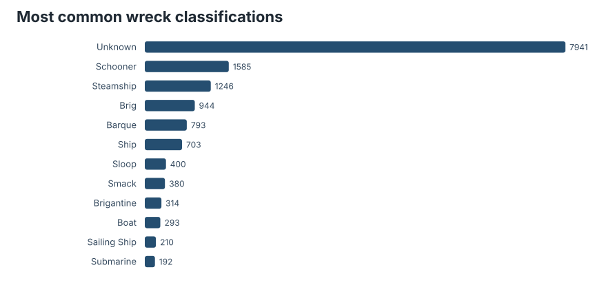
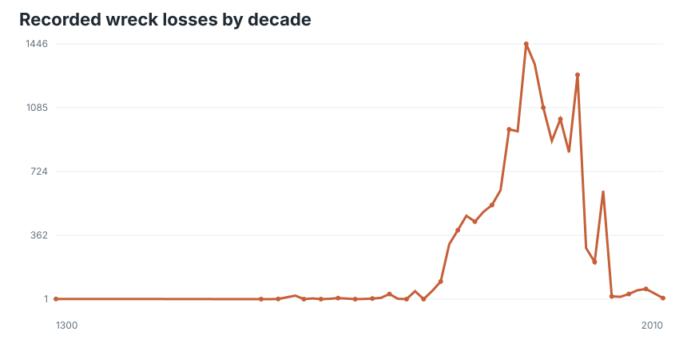
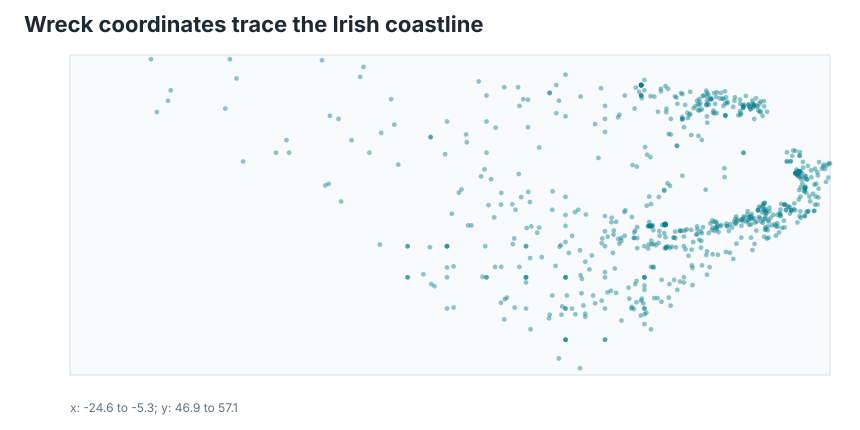

# Preface

From the [TidyTuesday repository](https://github.com/rfordatascience/tidytuesday/tree/main/data/2026/2026-06-30).

The Irish wreck inventory is not just a catalogue of ship names. It is a coastline-shaped memory system: 17,981 records, a long tail of vessel classifications, narrative descriptions of weather and cargo, and enough coordinates to show where archive work becomes geography.

## What is in the file

The dataset contains a loss date, parsed year, wreck name and number, classification, a free-text description, place of loss, coordinates, and coordinate source. I treated it as an inventory rather than a casualty model: the important first pass is coverage, not causal inference.

| Measure | Value |
|---|---:|
| Records | 17,981 |
| Distinct classifications | 138 |
| Records with usable coordinates | 3,564 |
| Earliest parsed year | 1300s |
| Latest parsed year | 2010s |

## Vessel types

The top of the classification table is practical rather than romantic: schooners, steamers, trawlers, and other working vessels dominate the named categories. That matters because it frames the inventory as commercial and coastal infrastructure history, not only spectacular disasters.

## Time

The decade curve should be read as recorded inventory intensity, not a clean rate of maritime danger. Still, the broad shape is useful. The 19th and early 20th century concentration reflects the age when Irish coastal trade, sail-to-steam transition, and documentary survival overlap most visibly.

## Place

The coordinate plot is deliberately plain: longitude against latitude. Even without a basemap, the island appears through absence and edge density. That is the signature of a place-based register — the data are about named events, but the spatial pattern is the coast doing what coasts do to vessels.

## Takeaway

This week rewards humble analysis. The wreck inventory is rich, but the mixed descriptions and uneven historical coverage make it risky to over-fit. The honest story is that administrative memory has a shape: categories reveal working vessels, dates reveal eras of documentation, and coordinates reveal where loss became record.

