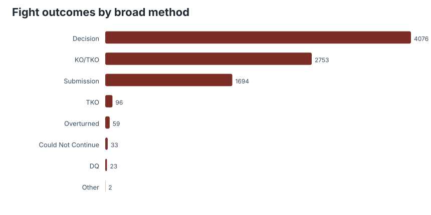
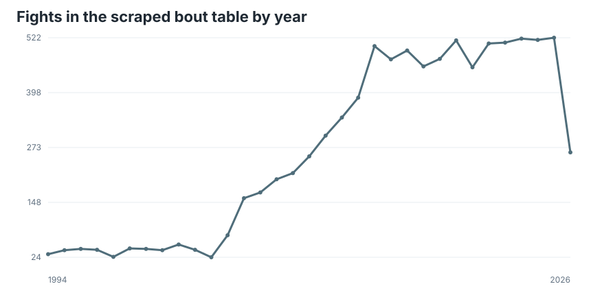
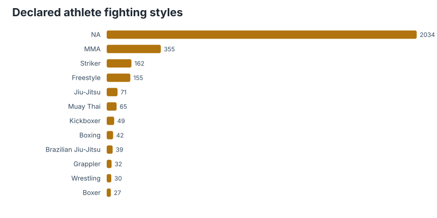

# Preface

From the [TidyTuesday repository](https://github.com/rfordatascience/tidytuesday/tree/main/data/2026/2026-07-07).

This week bundles several UFC tables from the `fightr` ecosystem: bout results, athlete profiles, ranking snapshots, betting-oriented features, and derived fight-level variables. I kept this pass descriptive. Combat-sports data are tempting prediction fuel, but the first question is simpler: what kind of sport is visible in the tables?

## Coverage

| Table | Rows |
|---|---:|
| `ufc_fights.csv` | 8,736 |
| `ufc_athletes.csv` | 3,145 |
| Distinct outcome methods | 8 |
| Distinct declared fighting styles | 20 |

## How fights end

The outcome table compresses the sport into a few administrative endings: decisions, knockouts, submissions, and smaller residual categories. Decision volume is a reminder that the popular highlight reel is not the median fight. A lot of the sport is rounds, scoring, and survivability.

## Time coverage

The fight table has the stepped shape of a growing promotion and a changing scrape target. Recent years dominate the record, so any longitudinal model would need to separate actual UFC growth from data availability and source completeness.

## Athlete labels

The declared style field is useful as vocabulary, but not as a clean taxonomy. Mixed martial arts rewards hybridity, and the profile labels are public-facing descriptors. I would use them for exploratory grouping, not as hard technical ground truth.

## Takeaway

The useful story here is not "who will win." It is that a modern fight dataset is a join of event history, athlete biographies, rankings, and market expectations. That makes it analytically rich, but also easy to confuse measurement systems. Treat records, profiles, rankings, and odds as separate layers before collapsing them into one prediction table.

