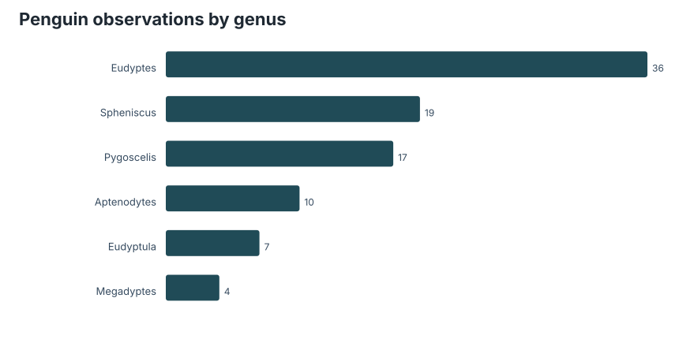
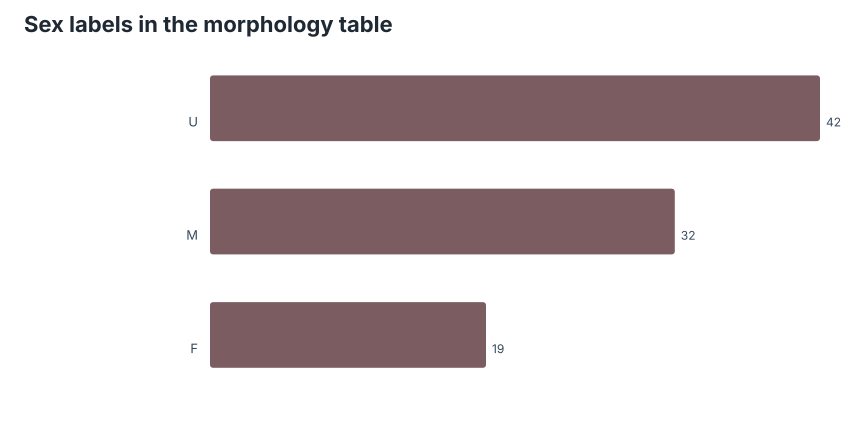
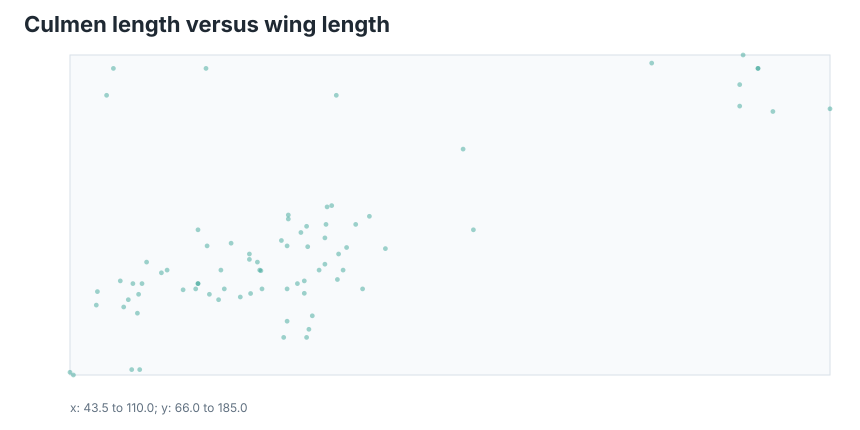

# Preface

From the [TidyTuesday repository](https://github.com/rfordatascience/tidytuesday/tree/main/data/2026/2026-07-14).

The `many_penguins` file is a small morphology slice from AVONET. It is compact enough to understand by inspection, but it carries the classic biological-data warning: the tidy table is not a sampling design. Species, genus, and sex labels are measurements and metadata, not guarantees of balanced coverage.

## Coverage

| Measure | Value |
|---|---:|
| Rows | 93 |
| Species | 18 |
| Genera | 6 |
| Usable beak/wing pairs | 79 |

## Taxonomic shape

The genus counts show the smallness of the file. This is not a citizen-science flood of repeated observations; it is a trait table. The unit of attention is the species/sex morphology record, so aggregation choices matter more than row count.

## Sex labels

The `U` category is not a nuisance to delete. Unknown or unsexed records are part of the evidence trail. Dropping them would make the table look cleaner while silently changing the biological coverage.

## Shape space

The beak-wing scatter is a quick morphology map. It shows separation in body plan without pretending that two measurements summarize a bird. As a first pass, though, it catches what makes penguins fun data objects: they are familiar animals with enough morphological spread to make simple plots legible.

## Takeaway

This week is a good antidote to overbuilt dashboards. A few rows, clear trait columns, and a modest scatterplot are enough to ask better questions: Which genera are morphologically distinct? Which sex labels are comparable? Which measurements scale together, and which describe different ecological constraints?

