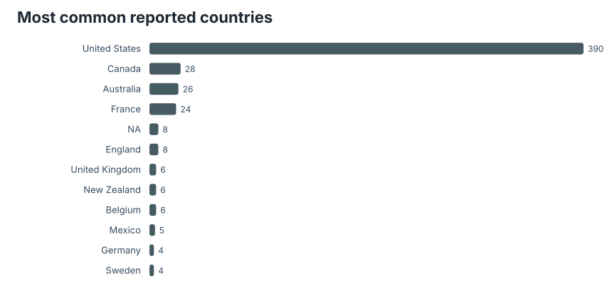
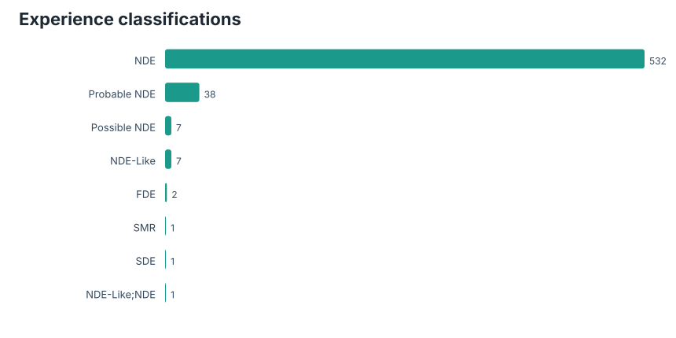
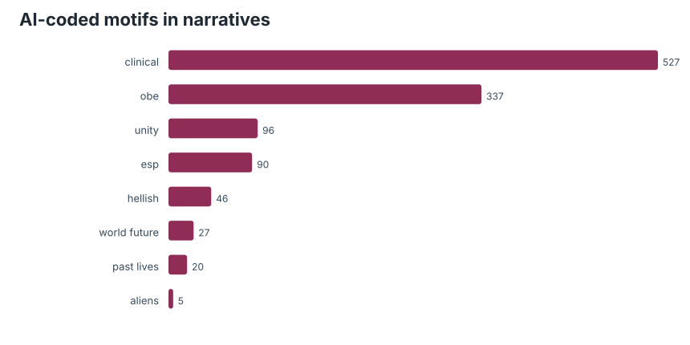

# Preface

From the [TidyTuesday repository](https://github.com/rfordatascience/tidytuesday/tree/main/data/2026/2026-07-21).

The NDERF file is sensitive data in the ordinary human sense, even when it is public and tabular. Each row points back to a narrated experience. I treated the dataset as a catalog of self-reports and labels, not as evidence for or against anyone's metaphysics.

## Coverage

| Measure | Value |
|---|---:|
| Rows | 589 |
| Countries/regions represented | 65 |
| Classifications | 8 |
| AI motif columns | 8 |

## Geography of the archive

The country distribution is mostly an archive-access pattern. English-language web forms, internet access, and willingness to submit a narrative all sit between experience and row. That makes geographic interpretation tricky: this is where reports came from, not where near-death experiences "happen."

## Classifications

The classification field is helpful because it acknowledges that the archive is not one homogeneous phenomenon. Near-death reports sit beside related categories, and analysis should preserve that distinction unless there is a clear reason to pool them.

## Coded motifs

The AI motif columns are useful as a rough index, not as a final reading. They invite questions about out-of-body experience, unity, clinical details, ESP claims, and other themes, but the labels should be checked against source narratives before any strong claim.

## Takeaway

This is a dataset where restraint is part of the method. Counts can summarize the archive, but they cannot carry the meaning of the stories alone. The right first pass is provenance-aware: who submitted, how the record was classified, and which computational labels are strong enough to support follow-up reading.

