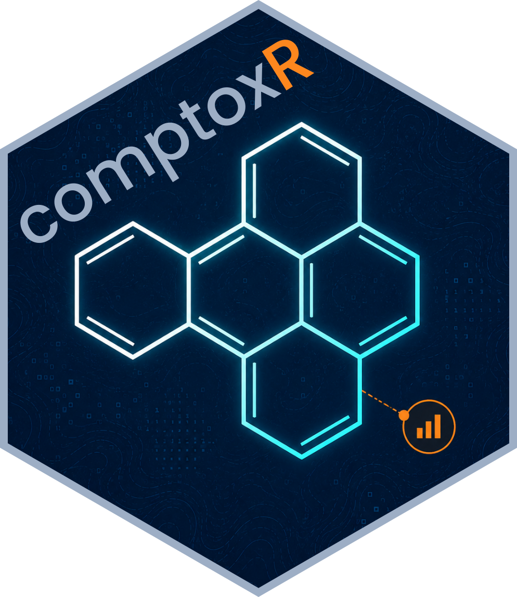
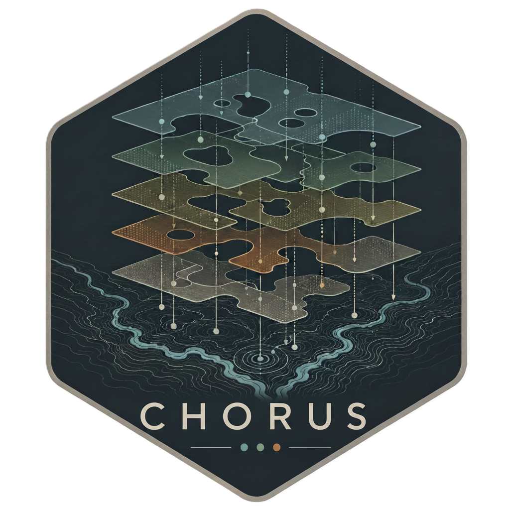
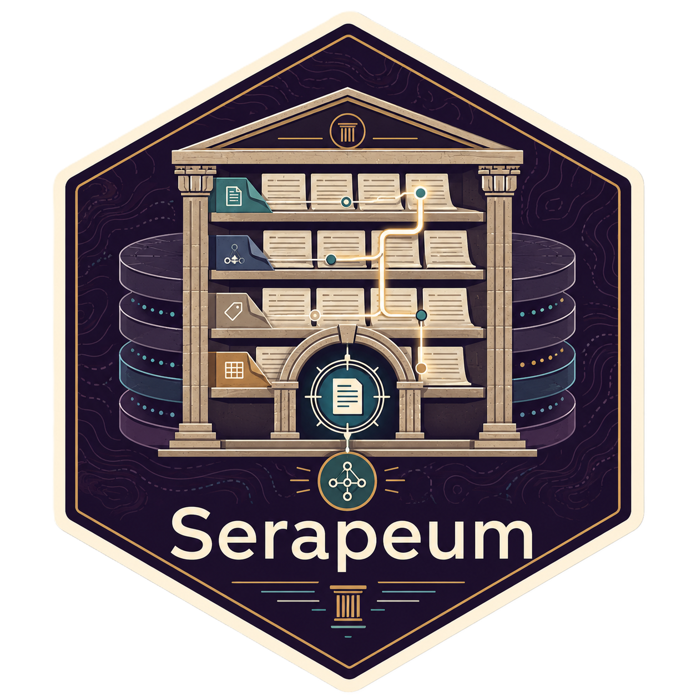

## Open Source Tools

::: {.work-card-grid}

::: {.card}
{.project-logo fig-alt="ComptoxR logo"}

### ComptoxR

R package for accessing US EPA CompTox Chemistry Dashboard APIs and related chemistry products. Supports programmatic retrieval of chemical identifiers, properties, hazard information, exposure predictions, and cheminformatics data for risk-evaluation workflows.

[GitHub](https://github.com/seanthimons/ComptoxR){.btn .btn-primary}
:::

::: {.card}
{.project-logo fig-alt="CHORUS logo"}

### CHORUS

Constituent Hazard, Occurrence, Regulatory, and Uncertainty Screening. A screening framework for prioritizing environmental constituents by combining hazard and fate signals, occurrence evidence, regulatory benchmarks, and uncertainty-aware decision logic.

[GitHub](https://github.com/seanthimons/chorus){.btn .btn-primary}
:::

::: {.card}
{.project-logo fig-alt="CONCERT logo"}

### CONCERT

Chemical ontology harmonization and entity-resolution toolkit for identifier crosswalking, canonicalization, data reconciliation, and defensible transformation of messy source records into analysis-ready chemical data.

[GitHub](https://github.com/seanthimons/concert){.btn .btn-primary}
:::

::: {.card}
{.project-logo fig-alt="Serapeum logo"}

### Serapeum

Local-first literature-review and research assistant built with R, Shiny, DuckDB, OpenAlex, and LLM-assisted analysis. Intended to make paper triage, metadata capture, and evidence synthesis reproducible instead of chat-log archaeology.

[GitHub](https://github.com/seanthimons/serapeum){.btn .btn-primary}
:::

:::

## Software and Tools I Use

| Area | Tools |
|:--|:--|
| **Analysis and visualization** | R, tidyverse, ggplot2, plotly, Quarto |
| **Applications and packages** | Shiny, bslib, R package development, pak, renv |
| **Databases and pipelines** | DuckDB, SQL, reproducible ETL, FAIR/DRY data curation |
| **Automation and integration** | Python, shell scripting, GitHub Actions, APIs |
| **Scientific and collaboration layer** | Git, GitHub, Obsidian, Markdown, citation workflows, AI coding agents when the work is bounded and reviewable |

## Research Focus

My EPA research spans risk characterization for water reuse, chemical safety data curation, and cross-disciplinary integration for chemical safety decision-making.

## Technical Support

-   Region 8 RARE project: *Evaluation of Produced Water Intended for Beneficial Reuse in Multiple Oil and Gas Basins*. Stakeholders include EPA’s Region 3 and 6, US Department of Energy’s National Energy Technology Laboratory, and US EPA ORD-CCTE/CEMM

    -   Front-end R Shiny application development for site prioritization utilizing field and experimental data for acute, chronic, and cumulative toxicological evaluation.

-   New Mexico Produced Water Research Consortium’s Risk and Toxicology work group (workgroup lead), the Multi-State Coordination Counsel, and the Water-Portal and Data Management work group.

    -   Development of risk-based workflow to assess acute and chronic potential across human and ecological receptors and determine potential for fit-for-purpose usage of treated produced water.

-   *Potable Water Reuse in Protein Production and Processing*, Collaborative partnership of Tyson Foods, University of Nebraska, and the United States Department of Agriculture

-   *Evaluating the Microbial and Chemical Quality of Air Handler Unit Condensate*, US EPA project

-   *Integrated Performance Framework for Emerging Contaminants in Wastewater Treatment Plants*, US EPA project

-   Technical support for New Mexico State University’s *Non-Targeted Analysis and Whole Effluent Toxicity* testing efforts for produced water to assess acute and chronic effects of exposure.

-   Technical support for *SSWR.411.3* : BIL/IIJA Funded Technical Assistance Projects to Support the Drinking Water State Revolving Fund

    -   Front-end R Shiny application development utilizing EJScreen and machine-learning models for site prioritization

## Selected Awards and Professional Experience

-   New Mexico Produced Water Research Consortium
-   US EPA *Shooting Star Award*: “Region 8 is grateful for your work organizing and analyzing our produced water data”

## Publications

::: {#refs}
[@*]
:::

## Presentations, Posters, and Panels

Talks, posters, panels, and slide decks now live in the dedicated [Presentations](presentations/index.qmd) archive.
