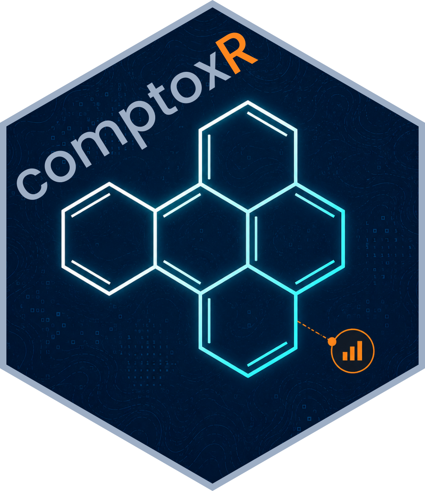
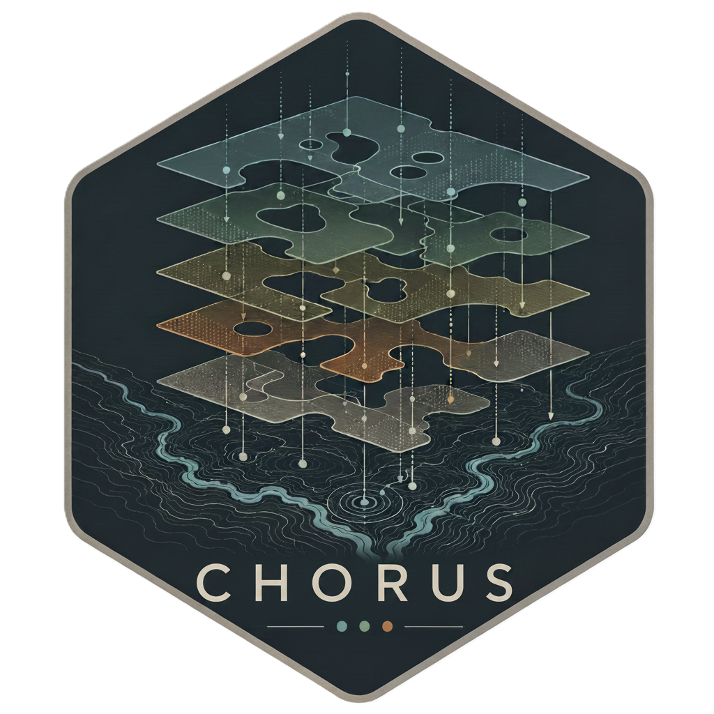
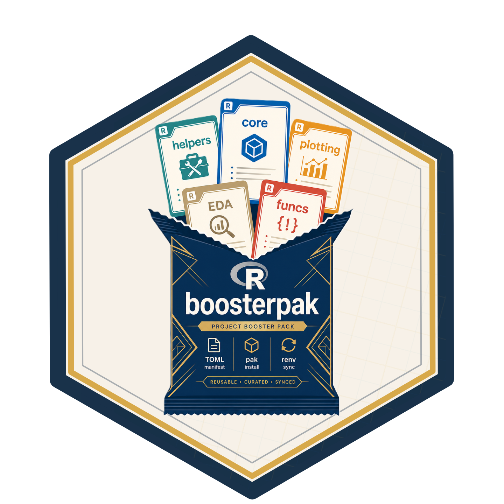
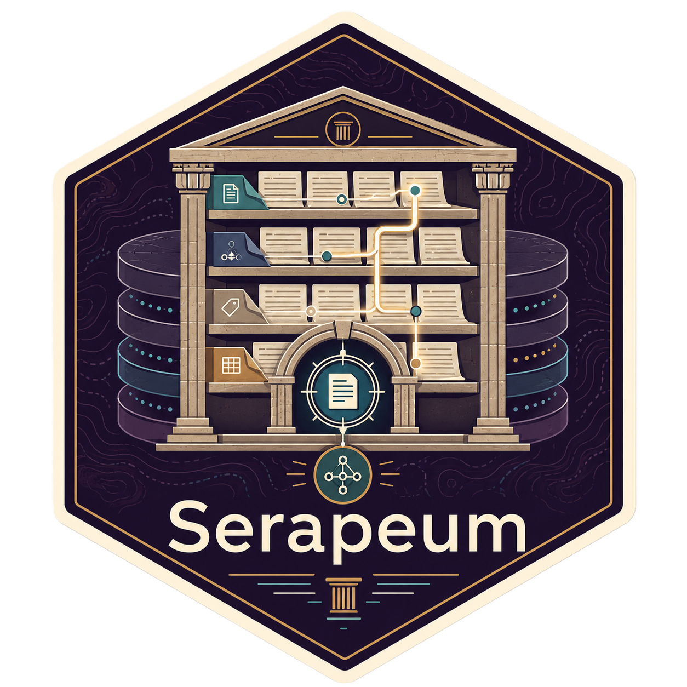

## Open Source Tools

::: {.work-card-grid}

::: {.card .card-comptoxr}
{.project-logo fig-alt="CompToxR hex sticker"}

### CompToxR

R package for accessing US EPA CompTox Chemistry Dashboard APIs and related chemistry products. Supports programmatic retrieval of chemical identifiers, properties, hazard information, exposure predictions, and cheminformatics data for risk-evaluation workflows.

[GitHub](https://github.com/seanthimons/ComptoxR){.btn .btn-primary}
:::

::: {.card .card-concert}
{.project-logo fig-alt="CONCERT hex sticker"}

### CONCERT

Chemical ontology harmonization and entity-resolution toolkit for identifier crosswalking, canonicalization, data reconciliation, and defensible transformation of messy source records into analysis-ready chemical data.

[GitHub](https://github.com/seanthimons/concert){.btn .btn-primary}
:::

::: {.card .card-chorus}
{.project-logo fig-alt="CHORUS hex sticker"}

### CHORUS

Constituent Hazard, Occurrence, Regulatory, and Uncertainty Screening. A screening framework for prioritizing environmental constituents by combining hazard and fate signals, occurrence evidence, regulatory benchmarks, and uncertainty-aware decision logic.

[GitHub](https://github.com/seanthimons/chorus){.btn .btn-primary}
:::

::: {.card .card-boosterpak}
{.project-logo fig-alt="boosterpak hex sticker"}

### boosterpak

Reusable R project capability packs: typed bundles of dependencies, optional source specs, startup attachment intent, helper-function sidecars, and project-local setup conventions for reproducible workflows.

[GitHub](https://github.com/seanthimons/boosterpak){.btn .btn-primary}
:::

::: {.card .card-specmill}
{.project-logo fig-alt="specmill hex sticker"}

### specmill

R package for generating and maintaining API clients from local OpenAPI schemas and reviewed YAML policy. Creates endpoint wrappers, documentation, and request contract tests while the client package retains control of HTTP, authentication, and response handling.

[GitHub](https://github.com/seanthimons/specmill){.btn .btn-primary}
:::

::: {.card .card-serapeum}
{.project-logo fig-alt="Serapeum hex sticker"}

### Serapeum

Local-first literature-review and research assistant built with R, Shiny, DuckDB, OpenAlex, and LLM-assisted analysis. Intended to make paper triage, metadata capture, and evidence synthesis reproducible instead of chat-log archaeology.

[GitHub](https://github.com/seanthimons/serapeum){.btn .btn-primary}
:::

:::

## Packages and tools I use

Most of my work starts in R. The rest of the stack exists to make the analysis inspectable, repeatable, and usable by someone other than the person who first wrote it.

| Work | Packages and tools |
|:--|:--|
| **Analysis and visualization** | R, tidyverse, dplyr, tidyr, readr, purrr, ggplot2, plotly |
| **Applications** | Shiny and bslib for interactive tools that put data and methods in front of the people who need to use them |
| **Reproducible projects** | Quarto for publishing, pak for installation, renv for project libraries and lockfiles, and [boosterpak](https://github.com/seanthimons/boosterpak) for reusable project capability packs |
| **Data and pipelines** | DuckDB, SQL, API clients, and reproducible ETL for chemical and environmental data curation |
| **Automation and collaboration** | Python, shell scripting, Git, GitHub Actions, Obsidian, Markdown, and citation workflows |

`boosterpak` is the piece I built for the gap between a package list and a project template. A pack can declare the dependencies, helper functions, startup choices, configuration, and checks needed for a particular kind of R project. `pak` still installs packages and `renv` still records the library. The pack records the working setup.

## Publications

::: {#refs}
[@*]
:::
